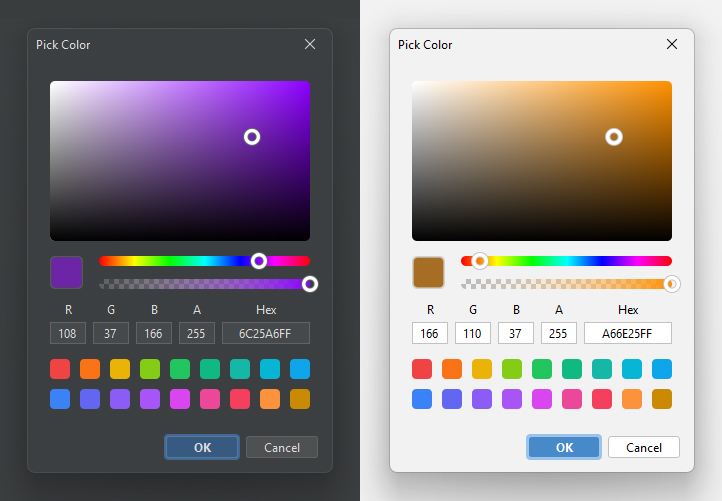

# Swing Color Picker

A Java Swing color picker built on FlatLaf, designed to work with built-in and customizable picker models, a color
palette, and configurable UI elements.

&nbsp;

## Installation

[](https://central.sonatype.com/artifact/io.github.dj-raven/swing-color-picker)

Add the dependency

``` xml
<dependency>
    <groupId>io.github.dj-raven</groupId>
    <artifactId>swing-color-picker</artifactId>
    <version>1.1.0</version>
</dependency>
```

### Snapshots

To get the latest updates before the release, you can use the snapshot version
from [Sonatype Central](https://central.sonatype.com/service/rest/repository/browse/maven-snapshots/io/github/dj-raven/swing-color-picker/)

``` xml
<repositories>
    <repository>
        <name>Central Portal Snapshots</name>
        <id>central-portal-snapshots</id>
        <url>https://central.sonatype.com/repository/maven-snapshots/</url>
    </repository>
</repositories>
```

Add the snapshot version

``` xml
<dependency>
    <groupId>io.github.dj-raven</groupId>
    <artifactId>swing-color-picker</artifactId>
    <version>2.0.0-SNAPSHOT</version>
</dependency>
```

## Usage

``` java
// create color picker object
ColorPicker colorPicker = new ColorPicker();

// create event color changed
colorPicker.addColorChangedListener((color, event) -> {
    // color changed
});

```

#### Show with Dialog

``` java
Color color = ColorPicker.showDialog(this, "Pick Color", Color.WHITE);

if (color != null) {
    // color selected
}
```

#### Change Model

``` java
// create color picker object with an initial model
ColorPicker colorPicker = new ColorPicker(new DiskColorPickerModel());

// change to a different color picker model
colorPicker.setModel(new CorelTriangleColorPickerModel());
```

### Available Model

| Model Name                      | Description                                   |
|---------------------------------|-----------------------------------------------|
| `DinoColorPickerModel`          | Default HSV color model                       |
| `DiskColorPickerModel`          | Circular color wheel                          |
| `CorelSquareColorPickerModel`   | Square color selector with circular hue wheel |
| `CorelTriangleColorPickerModel` | Triangle selector with circular hue wheel     |
| `CorelRhombusColorPickerModel`  | Rhombus  selector with circular hue wheel     |

## Library Resources

- [FlatLaf](https://github.com/JFormDesigner/FlatLaf) - FlatLaf library for the modern UI design theme
